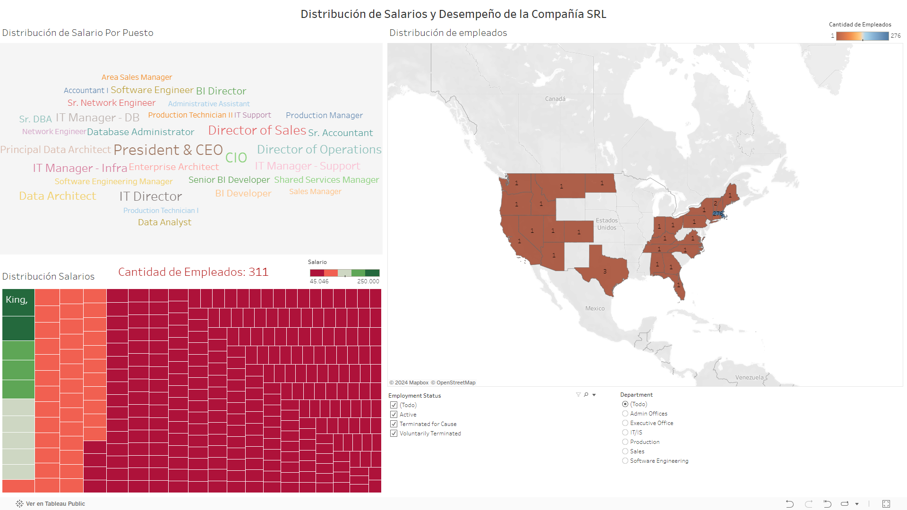
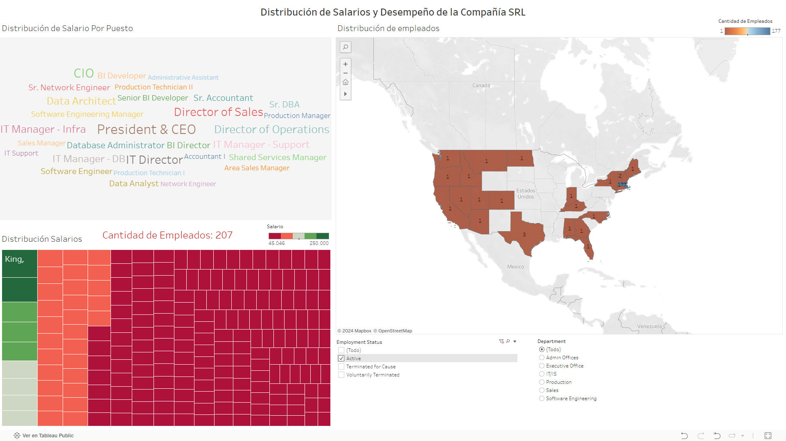
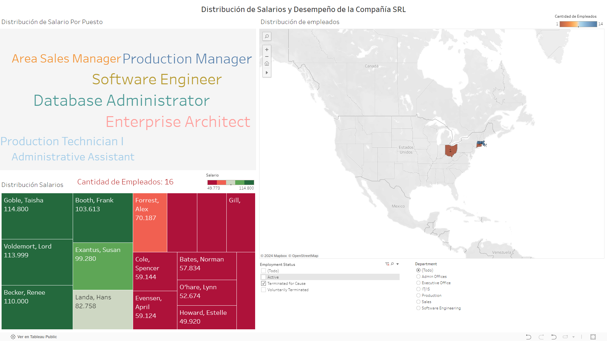
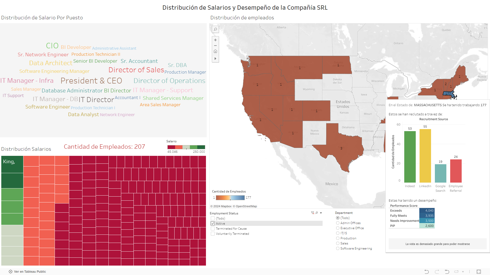
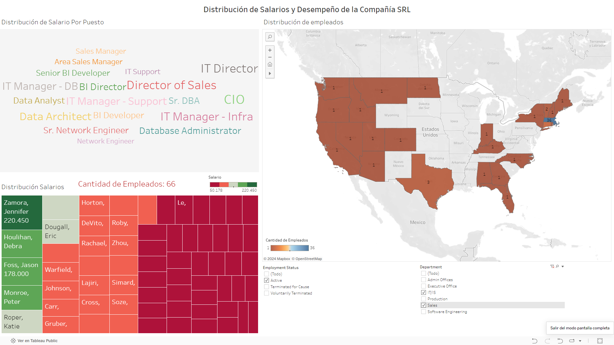

# Diplomado Analitica y Ciencia de Datos [Tableau].

## Contexto
Nos encontramos con los datos personales de los empleados de la compañía SRL, que incluyen información detallada sobre la contratación, desempeño, y características demográficas de cada empleado. Estos datos son cruciales para el análisis y la toma de decisiones en el departamento de Recursos Humanos.

## Objetivo
Los analistas de Recursos Humanos necesitan un dashboard interactivo y dinámico que les permita identificar puntos clave, y con base en ellos, optimizar la gestión del talento y fomentar un entorno laboral más inclusivo y diverso.

## Resultados
La compañia ha tenido en nomina un total de 311 empleados.

{width=100%}

Sin embargo, de ellos solo siguen activos 207, el resto, 88 han terminado su relación laboral por Voluntad Propia y 16 por despido legal.

## Conclusiones
Massachusetts, es el estado que contiene la mayor parte de la nomina. Y la principal fuente de reclutamiento está entre LinekIn y Indeed.

Las posiciones tienen mayores ingresos son las direcciones de los departamentos. Así como las que menos perciben dinero son los Técnicos de Producción.

Solo los departamentos de IT & Sales tienen personal que labora fuera del estado donde estan las operaciones.

### Fuentes

[Data Viz en Tableau Public](https://public.tableau.com/app/profile/juan.felipe.figueroa.rodr.guez/viz/Compaa_SRL/Dashboard?publish=yes)